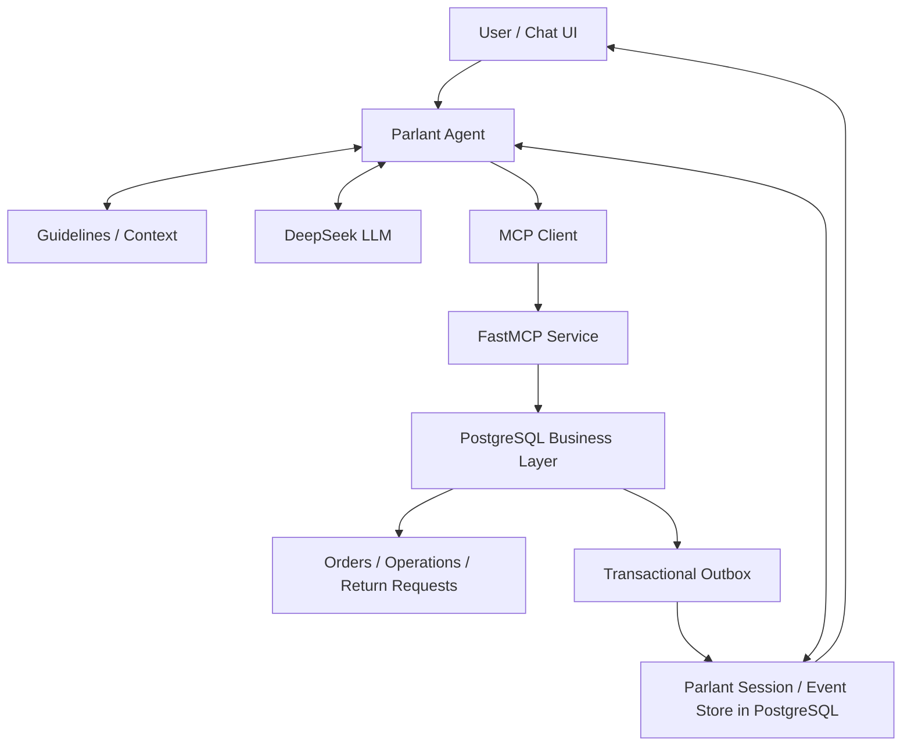
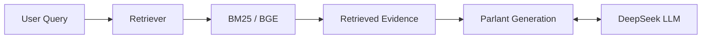
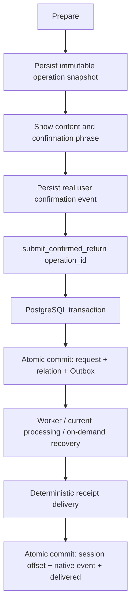

# Parlant Customer Service Agent

基于 **Parlant + DeepSeek** 构建的可执行事务型客服 Agent，集成 PostgreSQL 持久化、MCP 工具调用、确认后事务执行、幂等控制、Outbox 故障恢复和 RAG，并通过公开 benchmark 路径与自定义应用评测验证。

本机交互应用已部署 **APP-S1 已确认参数快照提交**，数据库迁移为 **001–005**。历史 Retail benchmark 保留 **O1-B**，RAG 保留 **R1-B**；C1 和 R2 作为实验记录。事务客服与知识检索是两个独立能力模块，分别启动，没有自动路由系统。

## Architecture



独立 RAG 路径通过原生 Retriever 将实际检索证据交给 Parlant：



## Core Features

- **Agent orchestration**：Parlant Guidelines、可信客户/会话上下文及 DeepSeek 官方 `deepseek-chat`。
- **MCP integration**：真实 FastMCP Streamable HTTP、原生 MCP 客户端及工具发现；业务工具实际读写 PostgreSQL。
- **Native persistence**：PostgreSQL-backed Parlant 会话、完整事件、客户和上下文变量，保留原生状态、metadata 与事件顺序。
- **Transaction-safe operations**：订单查询、退货资格检查及申请提交，后端校验归属、窗口、商品、数量和金额。
- **Human confirmation**：先展示内容，再记录真实用户完整确认口令；普通“确认”及模型生成的确认字段不能授权写入。
- **APP-S1 immutable snapshot**：模型提交时只提供 `operation_id`；订单、明细、数量、原因和金额由后端已确认快照读取。
- **Idempotency and concurrency**：事务、行锁、唯一约束及严格参数绑定，防止重复申请和超量占用。
- **Transactional Outbox**：提交与入队原子完成，重启继续投递，有限退避重试与人工失败通知重试。
- **Deterministic receipts**：依据数据库事实生成申请回执；支持按原操作恢复，明确申请提交不代表退款到账。
- **RAG retrieval**：完整官方 passage 上比较 BM25 与 BGE，记录证据是否进入生成上下文。
- **Evaluation infrastructure**：冻结配置、独立测试库、多轮脚本、只读数据库评分、故障注入及调用用量观测。

## Transaction Agent Evaluation

三组结果的任务、应用版本和评分范围不同，分别报告。

### τ³-bench Retail

历史公开 benchmark 路径使用官方 Retail 环境及评分、**DeepSeek 自定义配置**，不是官方 leaderboard 或 Parlant 官方分数。

| Configuration | Successes / executions | Success rate |
| --- | ---: | ---: |
| BASE（B0-R1） | 30/80 | 37.50% |
| O1-B | 47/80 | 58.75% |
| Change | — | **+21.25 percentage points** |

40个官方 test task，每题2次、每组80次执行。优化来自账户/订单查找推理与商品变体约束推理，没有模型训练；包含一次授权的基础设施恢复例外，未作统计显著性结论。该路径使用官方事务环境，与自建 PostgreSQL 演示应用分别实现。[规则与代表案例](docs/transaction_agent.md)。

### APP-EVAL-V1

PostgreSQL + HTTP MCP + Outbox 应用的**自定义验收基线**：20场景×2，固定身份、单实例、预设用户脚本，不是官方 benchmark 或真人浏览器测试。

| Metric | Frozen result |
| --- | ---: |
| Overall automatic score | **33/40 = 82.5%** |
| Valid return completion | **13/16 = 81.25%** |
| Correct rejection | 8/8 |
| No-model fault-injection checks | 18/18 |
| Observed incorrect persistent writes | 0 |

整体评分含5个fail、2个needs_review，不能将待复核默认通过；金额归属和旧口令验证范围的限制保留。合法退货的3个失败是模型改写已准备的原因，触发后端 `IDEMPOTENCY_CONFLICT`，没有错误落库。18次故障检查独立于40次业务任务；人工retry恢复不计作自动恢复。固定回执不算模型事实准确率。[协议及限制](apps/retail_demo/APP_EVAL_V1.md)。

### APP-S1

收敛提交接口为 `submit_confirmed_return(operation_id)`，避免模型在提交时重新填写业务参数。

| Metric | Result |
| --- | ---: |
| Historical V1 valid-return subset（同一新版评分） | 13/16 |
| APP-S1 original scorer after completion | 15/16 |
| APP-S1 same revised context scorer | **16/16** |
| Parameters consistent with confirmed snapshots | 16/16 |
| Observed parameter-rewrite conflicts | 0 |
| Observed incorrect persistent writes | 0 |
| Observed duplicate request / Outbox / canonical receipt | 0 / 0 / 0 |

8个固定合法场景×2的有限回归，包含一次跨日中断恢复和过期重新确认。原评分15/16与新版16/16的差异来自“不代表已退款”的否定语境误报修订，属于自动评分修订，没有人工事实裁判。不是同期A/B、新留出测试、整体客服准确率或统计显著性结论；不替换V1原40题结果。旧失败、原评分与未知调用用量保留。[APP-S1实现](apps/retail_demo/APP_S1.md) · [补齐与评分范围](apps/retail_demo/APP_S1_COMPLETION.md)。

## RAG Evaluation

IBM MTRAG human **Cloud 自定义 conversation-level HOLDOUT**，使用完整官方 passage_level 语料。11个对话、89轮，其中83轮有qrels计入指标；6轮无标注记 unavailable。当前用户问题作为query，不使用官方rewrite或参考答案检索。

| Metric | BM25 R0 | BGE R1-B |
| --- | ---: | ---: |
| Recall@5 | 22.31% | **36.55%** |
| Recall@10 | 26.73% | **40.60%** |
| nDCG@5 | 18.81% | **33.29%** |
| nDCG@10 | 20.65% | **35.23%** |

R1-B使用现成 `BAAI/bge-base-en-v1.5`、归一化向量及当前问题查询，没有重新训练；Top-10用于检索评分，Top-5完整片段用于回答。以上是**retrieval improvement**，不等于最终回答准确率，也不是完整MTRAG test成绩。

R2 evidence-aware generation使用相同检索结果，仅调整生成阶段证据组织；11个固定目标轮次的同期CONTROL/R2对照没有显示稳定生成收益，辅助lexical F1、ROUGE-L略降。最终保留R1-B，R2作为负实验。词面相似度、引用有效和证据覆盖均不等于回答 factual accuracy。[RAG说明](docs/rag_agent.md)。

## Reliability Design



`operation_id`只是引用，不是授权。未确认、首次提交已过期或被显式替代的操作不能提交；修改同一未提交退货的内容须重新展示和确认，独立退货不会仅因当前指针变化被撤销。已提交操作幂等返回同一申请，不受原口令过期影响。

MCP响应丢失或worker退出后依据持久状态查询/恢复原操作；不凭未知结果生成新键重提。Outbox按操作与通知类型去重，投递事务保证唯一原生回执；每轮最多5次自动尝试，持续失败进入failed。人工retry只重试通知，保留累计次数和错误记录，不重新提交申请。`delivered`仅表示回执已持久化，不表示用户已读。后台回执不改变当前操作指针，主动查询可生成独立 `query_response`。

## Quick Start

需要 **Python 3.12、Docker Compose** 和可用本地embedding资产。当前验证环境：Parlant3.3.2、FastMCP4.0.10、MCP2.2.0、PostgreSQL16。应用独立venv仅追加 `psycopg[binary]==3.3.6`，不整体升级已有项目环境。

以下是**全新本机演示库**的启动步骤；已有环境保留原配置和venv，不重复bootstrap或seed：

```bash
# 已有根 .venv 时跳过创建及安装；精确依赖参见 uv.lock。
python3.12 -m venv .venv
.venv/bin/python -m pip install -r requirements.txt

# 仅不存在时创建配置，保留现有文件和符号链接。
if [ ! -e apps/retail_demo/.env ] && [ ! -L apps/retail_demo/.env ]; then
  cp apps/retail_demo/.env.example apps/retail_demo/.env
  chmod 600 apps/retail_demo/.env
fi
if [ ! -e .env ] && [ ! -L .env ]; then
  touch .env
  chmod 600 .env
fi
# 编辑根 .env，配置 DEEPSEEK_API_KEY；
# 编辑应用 .env，将 DEMO_DB_PASSWORD 占位符替换为自己的本地密码。
# 应用DSN通过dotenv插值读取该密码。不要将这些配置提交到Git。

.venv/bin/python apps/retail_demo/bootstrap.py
# 缓存已有时跳过下载；仅为Parlant内部embedding，不是RAG的BGE模型。
HF_HOME="$PWD/runtime-data/huggingface" .venv/bin/python -c 'from transformers import AutoModel, AutoTokenizer; n="sentence-transformers/paraphrase-multilingual-MiniLM-L12-v2"; AutoTokenizer.from_pretrained(n); AutoModel.from_pretrained(n, use_safetensors=True)'
docker compose --env-file apps/retail_demo/.env -f apps/retail_demo/compose.yaml up -d --wait
apps/retail_demo/.venv/bin/python -m apps.retail_demo.db setup
apps/retail_demo/.venv/bin/python -m apps.retail_demo.manage start
```

`db setup`仅用于首次创建演示夹具；已运行PG实例升级使用**停写备份 → `db init` → 完整重启**，不得重导旧local或覆盖申请。迁移005及只读回滚步骤见 [MIGRATION.md](apps/retail_demo/MIGRATION.md)。当前本机实例已部署005，无需重复执行升级。

打开 **http://127.0.0.1:8810/chat/**，选择 `retail-persistent-demo` 和 `demo-alice`。演示流程：查询 `DEMO-1001` → 请求退指定明细及数量、说明原因 → 核对客服展示的内容 → 复制实际展示的完整确认口令 → 收到真实 `request_id` 与submitted状态 → 查询同一申请。申请提交不表示退款到账。

```bash
apps/retail_demo/.venv/bin/python -m apps.retail_demo.manage status
apps/retail_demo/.venv/bin/python -m apps.retail_demo.outbox status
apps/retail_demo/.venv/bin/python -m apps.retail_demo.manage stop
```

停止应用保留PG及其持久卷。完整安装、通知状态/重试、迁移及离线验证命令见 [应用README](apps/retail_demo/README.md)。最新部署仅完成无模型Store/MCP/HTTP验收，真人浏览器完整退货流程仍待手动验收；历史failed冒烟记录保留。

## Repository Structure

| Path | Purpose |
| --- | --- |
| `src/parlant/` | 保留Parlant SDK、引擎、原生UI及DeepSeek适配器 |
| `apps/retail_demo/` | PG业务、MCP、APP-S1、原生Store、Outbox、迁移及隔离应用评测 |
| `benchmarks/parlant_retail*/` | 历史Retail事务benchmark实现、策略与协议 |
| `benchmarks/parlant_rag*/` | MTRAG Cloud检索、生成及离线评分实现 |
| `configs/` | 历史展示默认配置与精简结果摘要，不执行自动路由 |
| `docs/` | 工程说明、案例与公开复现入口 |
| `results/`, `_reviews/` | 本地实验资产，Git忽略；独立演示应用不以其为源码依赖 |
| `runtime-data/` | 本地数据库相关备份、会话配置、模型缓存和日志，Git忽略 |

历史benchmark runner保留冻结校验，需要用户另行获取合法数据、模型及冻结资产，fresh clone不能直接恢复本地历史分数。参考 [复现说明](docs/reproduce.md)，执行生成/评测可能产生费用。公开仓库不包含数据集、密钥、权重、完整审计报告或原始API运行包。

## Limitations

- 演示身份固定在本机，缺少生产多用户认证，服务仅绑定loopback。
- 限定单Parlant instance；不提供多实例调度。
- 支持订单查询和单明细退货申请，没有真实支付、退款、审批或物流。
- 原生Parlant UI是开发界面，不应直接作为公开业务管理入口。
- 外部LLM非确定；已观察样本和benchmark成绩不能直接解释为生产可靠性。
- 事务提交约束保护数据库，但不保证模型普通问答事实正确。
- RAG retrieval指标不等于回答factual accuracy；自由文本人工标签未伪造为已复核。

## Attribution and License

基于 [Parlant](https://github.com/emcie-co/parlant) v3.3.2，保留上游源码、作者与 [Apache-2.0 LICENSE](LICENSE)。Retail环境来自 [tau2-bench](https://github.com/sierra-research/tau2-bench)，RAG数据来自 [IBM MTRAG](https://github.com/IBM/mt-rag-benchmark)，dense模型来自 [BAAI BGE](https://huggingface.co/BAAI/bge-base-en-v1.5)。外部数据和模型遵守各自许可。
